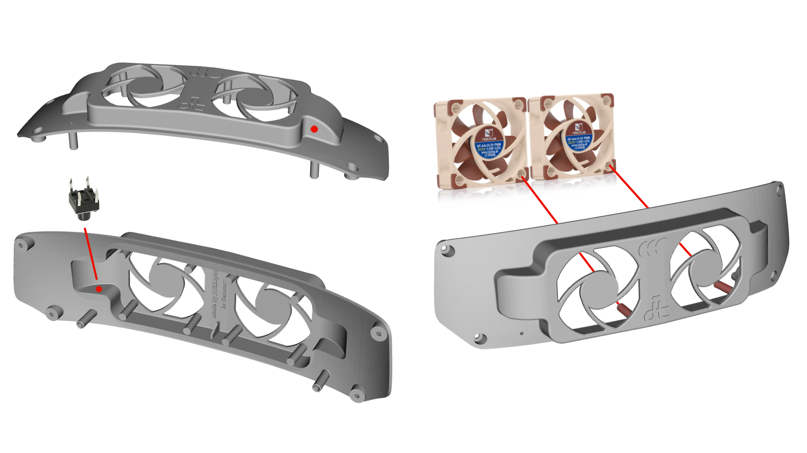
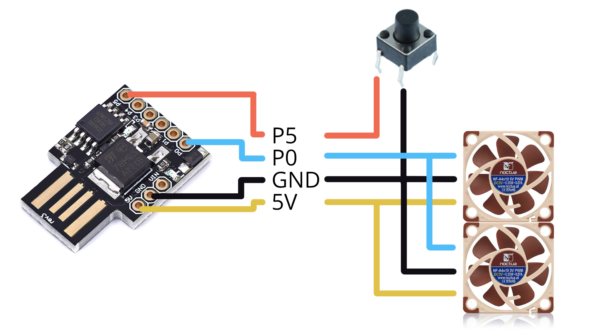

# Valve Index Headset Cooling System

A high quality simple to build cooling system for the Valve Index virtual reality headset.

This mods is awesome for keeping the HMD cool in games you play for a long time (set to 25% fan speed), or for playing high intensity VR games for much longer than you would normally be able to (50-100% fan speeds).

At the time of writing I have been using it for almost a year so it has proven to stand the test of time.

- [Valve Index Headset Cooling System](#valve-index-headset-cooling-system)
  - [Video](#video)
  - [Required Tools](#required-tools)
  - [Required Parts](#required-parts)
  - [Build Description](#build-description)
  - [How to say thanks](#how-to-say-thanks)
  - [Attributions](#attributions)
  - [Amazon Part Links](#amazon-part-links)

## Video

Please watch the following video for more information, and to see a demonstration.

## Required Tools

- Computer with Arduino software and Digispark driver installed
- Hot Glue Gun
- Torx T5 screwdriver
- Soldering Iron

## Required Parts

Non-affiliate [Amazon part links](#amazon-part-links) are included below, you can usually find items cheaper through local suppliers or ebay though.

- 1 * Digispark (get version that plugs directly into USB port)
- 2 * Noctua NF-A4x10 PWM 5V
- 1 * 6x6x7mm Momentary panel switch
- 1 * 3D Printed HMD fascia, [order it 3d Printed in high quality here](https://www.shapeways.com/product/QNZZ3EQN9/valve-index-headset-cooling-system)
- Some Wire

## Build Description

1. Install Arduino and the Digispark drivers on your computer
    - Arduino <https://www.arduino.cc/en/software>
    - Digispark driver and install instructions <https://github.com/digistump/DigistumpArduino/releases>
2. Load the [.ino file from the Index_Fan_PWM folder](./Index_Fan_PWM/Index_Fan_PWM.ino) into the Arduino application and write firmware to your Digispark as shown in video
3. Assemble switch and fans in to 3D Printed fascia
    - Drill hole where indicated for momentary switch
    - Using hot glue gun mount switch inside the fascia in orientation shown
    - Mount fans into the 3D Printed fascia with the labels facing towards the front
    

4. Cut wires to length and solder to Digispark as per schematic
    - If your new to soldering here is a tutorial <https://www.youtube.com/watch?v=Qps9woUGkvI>
    

5. Plug Digispark into a USB power supply and press momentary switch to confirm fan speed changes
    - there are 5 speed states: Off, 25%, 50%, 75%, 100%
6. Using the Torx T5 screwdriver remove stock fascia from HMD
7. Carefully plug Digispark into the HMD USB port
8. Screw the printed fascia into place on the HMD
9. Clean up your workspace
10. Enjoy a cooler VR experience!

## How to say thanks

You can say thanks in the following ways

- Give the youtube video a thumbs up
- Subscribe to the [ItsVRK YouTube channel](https://youtube.com/ItsVRK)
- Give a shout out on Twitter [@Konstruukt](https://twitter.com/konstruukt)
- Join the ItsVRK Discord server <https://discord.gg/Fv3buZ92pJ>
- If you value my content, I would be eternally grateful if you donate towards the cost of developing future material

    

    

## Attributions

The model used for the fascia was created by [JLI.space](https://www.thingiverse.com/JLIspace) and is licensed under the [Creative Commons - Attribution - Share Alike](https://creativecommons.org/licenses/by-sa/3.0/) license. I initially tried printing this with my FDM printer but found the quality lacking, hence the link to order a high quality print via Shapeways.

Many thanks to Renee Cousins who helped me with button debounce on the code for the Digispark, check out her project [The Buffee Accelerator Project](https://www.buffee.ca/about/) an accelerated implementation of the motorolla 68000 processor that is a drop in hardware replacement for original chips.

## Amazon Part Links

These are not affiliate links, however I suggest you support local suppliers or check on Ebay as they are both usually significanly cheaper.

Australia:

- <https://www.amazon.com.au/s?k=digispark>
- <https://www.amazon.com.au/s?k=NF-A4x10+PWM+5V>
- <https://www.amazon.com.au/s?k=6+x+6+x+7mm+momentary+panel+switch>

Brazil:

- <https://www.amazon.com.br/s?k=digispark>
- <https://www.amazon.com.br/s?k=NF-A4x10+PWM+5V>
- <https://www.amazon.com.br/s?k=6+x+6+x+7mm+momentary+panel+switch>

Canada:

- <https://www.amazon.ca/s?k=digispark>
- <https://www.amazon.ca/s?k=NF-A4x10+PWM+5V>
- <https://www.amazon.ca/s?k=6+x+6+x+7mm+momentary+panel+switch>

China:

- <https://www.amazon.cn/s?k=digispark>
- <https://www.amazon.cn/s?k=NF-A4x10+PWM+5V>
- <https://www.amazon.cn/s?k=6+x+6+x+7mm+momentary+panel+switch>

France:

- <https://www.amazon.fr/s?k=digispark>
- <https://www.amazon.fr/s?k=NF-A4x10+PWM+5V>
- <https://www.amazon.fr/s?k=6+x+6+x+7mm+momentary+panel+switch>

Germany:

- <https://www.amazon.de/s?k=digispark>
- <https://www.amazon.de/s?k=NF-A4x10+PWM+5V>
- <https://www.amazon.de/s?k=6+x+6+x+7mm+momentary+panel+switch>

India:

- <https://www.amazon.in/s?k=digispark>
- <https://www.amazon.in/s?k=NF-A4x10+PWM+5V>
- <https://www.amazon.in/s?k=6+x+6+x+7mm+momentary+panel+switch>

Italy:

- <https://www.amazon.it/s?k=digispark>
- <https://www.amazon.it/s?k=NF-A4x10+PWM+5V>
- <https://www.amazon.it/s?k=6+x+6+x+7mm+momentary+panel+switch>

Japan:

- <https://www.amazon.co.jp/s?k=digispark>
- <https://www.amazon.co.jp/s?k=NF-A4x10+PWM+5V>
- <https://www.amazon.co.jp/s?k=6+x+6+x+7mm+momentary+panel+switch>

Mexico:

- <https://www.amazon.com.mx/s?k=digispark>
- <https://www.amazon.com.mx/s?k=NF-A4x10+PWM+5V>
- <https://www.amazon.com.mx/s?k=6+x+6+x+7mm+momentary+panel+switch>

Netherlands:

- <https://www.amazon.nl/s?k=digispark>
- <https://www.amazon.nl/s?k=NF-A4x10+PWM+5V>
- <https://www.amazon.nl/s?k=6+x+6+x+7mm+momentary+panel+switch>

Poland:

- <https://www.amazon.pl/s?k=digispark>
- <https://www.amazon.pl/s?k=NF-A4x10+PWM+5V>
- <https://www.amazon.pl/s?k=6+x+6+x+7mm+momentary+panel+switch>

Singapore:
- <https://www.amazon.sg/s?k=digispark>
- <https://www.amazon.sg/s?k=NF-A4x10+PWM+5V>
- <https://www.amazon.sg/s?k=6+x+6+x+7mm+momentary+panel+switch>

Spain:

- <https://www.amazon.es/s?k=digispark>
- <https://www.amazon.es/s?k=NF-A4x10+PWM+5V>
- <https://www.amazon.es/s?k=6+x+6+x+7mm+momentary+panel+switch>

Turkey:

- <https://www.amazon.com.tr/s?k=digispark>
- <https://www.amazon.com.tr/s?k=NF-A4x10+PWM+5V>
- <https://www.amazon.com.tr/s?k=6+x+6+x+7mm+momentary+panel+switch>

United Arab Emirates:

- <https://www.amazon.ae/s?k=digispark>
- <https://www.amazon.ae/s?k=NF-A4x10+PWM+5V>
- <https://www.amazon.ae/s?k=6+x+6+x+7mm+momentary+panel+switch>

United Kingdom:

- <https://www.amazon.co.uk/s?k=digispark>
- <https://www.amazon.co.uk/s?k=NF-A4x10+PWM+5V>
- <https://www.amazon.co.uk/s?k=6+x+6+x+7mm+momentary+panel+switch>

United States

- <https://www.amazon.com/s?k=digispark>
- <https://www.amazon.com/s?k=NF-A4x10+PWM+5V>
- <https://www.amazon.com/s?k=6+x+6+x+7mm+momentary+panel+switch>
